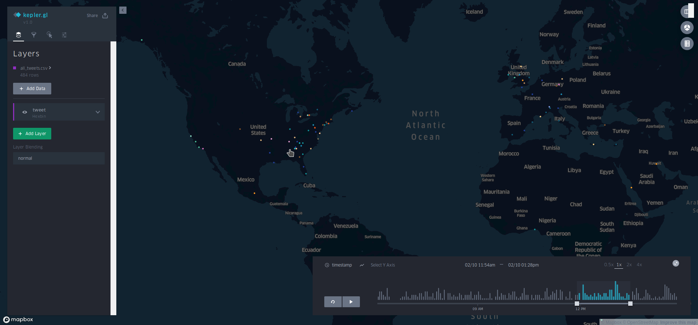

# GeoTwit - Hacklahoma 2019

## Motivation

Analysis of local trending topics and the geographic distribution of data from social media such as Twitter can be extremely useful - for example, in disaster management or for analyzing viral outbreaks. Platforms like Twitter consist of rapidly evolving data as people discuss recent events. Therefore, qucikly obtaining up-to-date and trending data from social networks is desirable.

With this in mind, we present GeoTwit, a data analysis and visualization workflow for geographic and temporal twitter data. Given a set of phrases, GeoTwit collects geotagged tweets containing each phrase and uses kepler.gl to visualize the resultant data set over space and time. For example, given a set of common political words ("Donald Trump", "Hillary Clinton", "Riot", "Yellow Vests") or weather events ("Fire", "Wildfire", "Smoke"), GeoTwit can visualize where and when tweets occur containing each of these phrases.

Moreover, we provide functionality to extract important words from a corpus of tweets (these words represent "trending topics" for the timeframe over which the corpus was collected). With these words, one can generate a new corpus, providing an iterative approach to tracking trending topics over space and time.

## What it does

GeoTwit is an iterative data visualization workflow for geographic and temporal Twitter data. It provides tools to generate a corpus of tweets from a list of words or phrases via the free Twitter streaming API including the coordinates, timestamp, status text, and the associated word or phrase for each Tweet.

This data may be directly mapped via Kepler.gl. However, GeoTwit provides additional functionality. The 400 most important words from the corpus can selected using tf-idf weighting with popular.py. (We use 400 words as this is the maximum number of features which may be tracked via the free Twitter streaming API)

The recommended workflow is therefore to generate a seed corpus from the [400 most common English words](https://gist.github.com/deekayen/4148741), as this will generate an unbiased set of pseudo-random geo-tagged tweets. From this, the 400 top trending words or phrases are generated. Using this set of popular phrases, a new set of tweets can be generated, graphed, and analyzed. This may continue iteratively, with each successive iteration tracking the trending words, phrases, and topics of the previous corpus.

As the corpus grows, tf-idf weighting increases in accuracy. Due to limitations of the free Twitter API and the relatively low number of tweets which are geo-tagged (~2-5%), generating a large body of data is time-intensive. Each iteration is therefore recommended to span multiple weeks.

## Use and Workflow

If you simply wish to view our example data set, head to [kepler.gl](http://kepler.gl/demo) and upload our provided keplergl.json file. Otherwise, continue.

Clone this repository

Edit the keys.json file with your Twitter application keys. You can obtain these from the [Twitter developer page](https://developer.twitter.com/content/developer-twitter/en.html).

Install pipenv, run the command  `pipenv shell` to enter the shell

Create a track.txt file containing a list of phrases (one per line, max 400) to query. If you wish to generate a seed corpus from the most common english words, [this list](https://gist.github.com/deekayen/4148741) is helpful.

Run geotwit.py to generate the corpus. **This is a long-running script, and may take weeks to generate a sufficiently large corpus**.

Run aggregate.py for post-processing, preparing data for Kepler.gl

Go to [kepler.gl](http://kepler.gl/demo) and upload keplergl.json

This will generate a visualization of the dataset using our recommended parameters. From here, modify parameters via kepler.gl to fit your visualization needs.

You may now run popular.py to generate a list of the 400 most important phrases (max 2 words) from the corpus. This will be saved to topn.txt.

For the next iteration, copy topn.txt to track.txt and begin again with geotwit.py.
